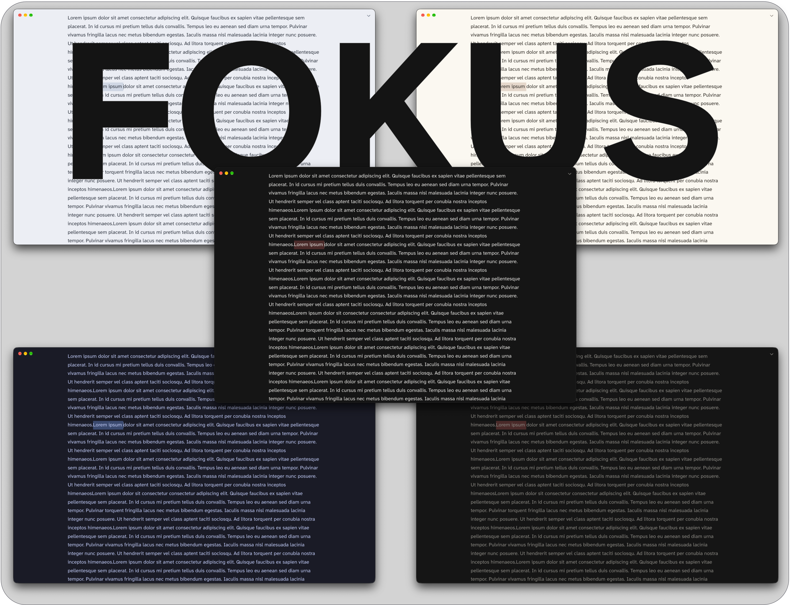

# Fokus Window Mode

Companion plugin for the **[Fokus](https://github.com/ike-V/obsidian-fokus)** theme: one toggle turns Obsidian into a distraction-free Fokus window.

## Fokus window

**⌘+\\** or the ⌃ chevron in the tab bar turns the window into a single page of writing.

- **Hides the ribbon, tab bar, title bar and status bar** by default; keep any of them in **Style Settings → Fokus Style Settings**.
- **Sidebars stay closed** until you leave, so a stray hotkey can't pull one over your text. They return exactly as they were.
- **No scrollbars.** Scrolling still works; the bar just isn't drawn.
- **Still a normal window.** It drags by its top edge, and the macOS window buttons stay clear of your text.
- **Leave** with ⌘+\\ or the ⌄ chevron in the top-right corner. Prefer the hotkey alone? Turn on *Hide the chevron buttons*.
- **Nothing is changed** in your workspace or settings; Fokus mode is a single on/off switch.

The plugin only adds the command, hotkey and chevrons; the Fokus theme does the hiding.

## The Fokus theme

A borderless theme with 20+ color schemes (light and dark), your own accent and fonts, and rounded corners beside the sidebars. See **[Fokus](https://github.com/ike-V/obsidian-fokus)** for the full feature list.

## Companions

| | |
|---|---|
| [Fokus](https://github.com/ike-V/obsidian-fokus) theme | Required; it does the hiding |
| [Style Settings](https://github.com/mgmeyers/obsidian-style-settings) | Optional; choose what the Fokus window hides |

## Requirements

- Desktop only.

## Install

Manual: copy `main.js` and `manifest.json` into `.obsidian/plugins/fokus/`, then enable **Fokus Window Mode** in **Settings → Community plugins**.

## License

[MIT](LICENSE)
