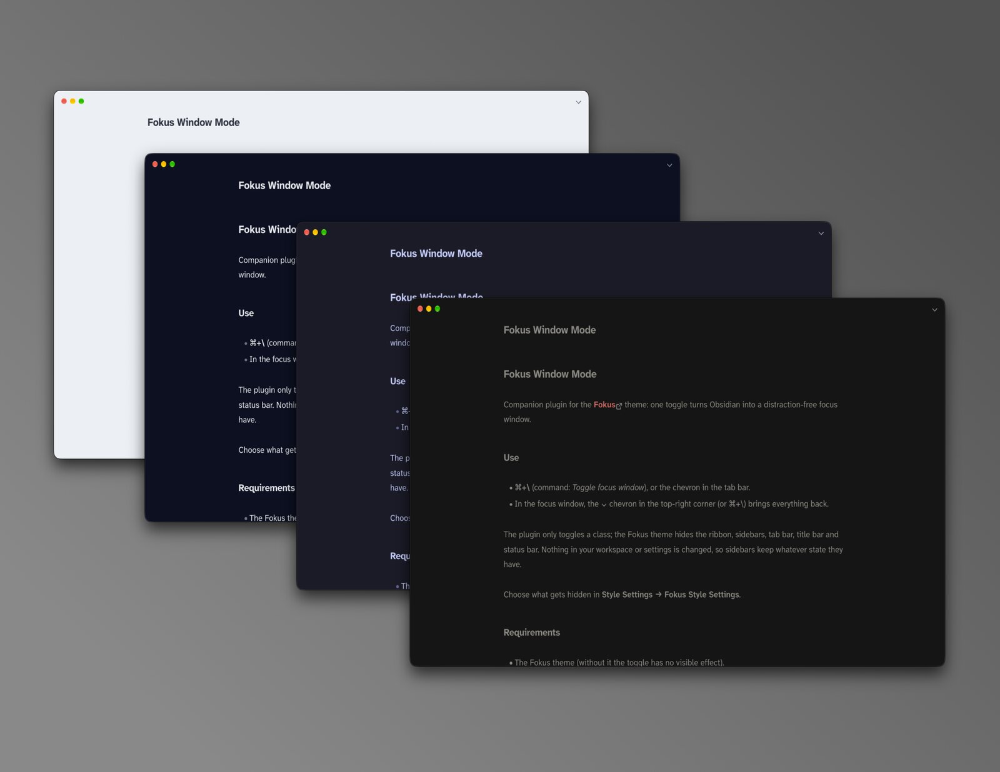
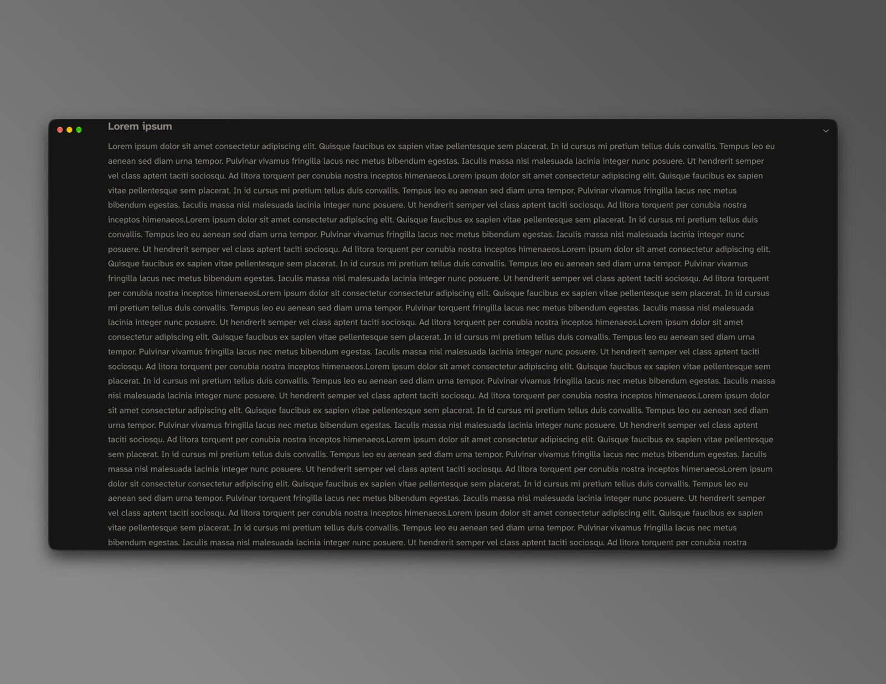

# Fokus Window Mode

Companion plugin for the **[Fokus](https://github.com/ike-V/obsidian-fokus)** theme: one toggle turns Obsidian into a distraction-free focus window.

## Use

- **⌘+\\** (command: *Toggle focus window*), or the chevron in the tab bar.
- In the focus window, the ⌄ chevron in the top-right corner (or ⌘+\\) brings everything back.

The plugin only toggles a class; the Fokus theme hides the ribbon, sidebars, tab bar, title bar and status bar. Nothing in your workspace or settings is changed, so sidebars keep whatever state they have.

Choose what gets hidden in **Style Settings → Fokus Style Settings**.

## Requirements

- The Fokus theme (without it the toggle has no visible effect).
- Desktop only.

## Install

Manual: copy `main.js` and `manifest.json` into `.obsidian/plugins/fokus/`, then enable **Fokus Window Mode** in **Settings → Community plugins**.

## License

[MIT](LICENSE)
